This is haw to modify your servos for getting addition position feedback. 
The following process is inspired by https://www.instructables.com/Using-SG90-or-MG90-Servo-Feedback-Modification-for/
There is other threads around but this one wraps up properly. 

For repo's own longevity, the base modification process is explained below. 

## Why modifying MG90S and PTK7465 servo? 

You are blind regarding at real position value of those servos. Indeed, when you set up a value with for example ```servo.write()```, this is a target value. Accordingly, when you access to ```servo.read()``` you simply read target's value. 

While the motor is moving, you'll observe a delay between the target value you've set and actual current position value of the serve. 

The following modification enables you to get feedback from *real current position value* from your servo. **This will be fundamental for further fine control of the whole robot** (we'll not rely on motor's position gain controllers).


## How to modify servos ?

The process is common to MG90S and PTK7465, but here follow images from both motors.

### MG90S

First set the servo upside down as follows. 
<div>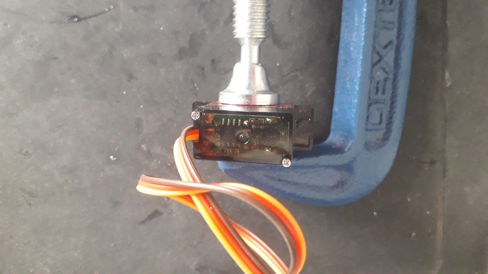 </div>

Then, unscrew carefully the bottom cover screws and remove it. While doing so, take care not to move top cover (not shown) which contains reductor and is now loose too. 

Potentiometer pins are those three in a row the middle of controller's board.
<div>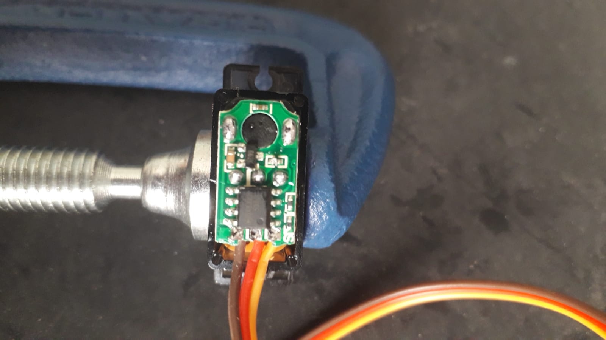 </div>

Sold a jumper wire on potentiometer pin as below.  
<div>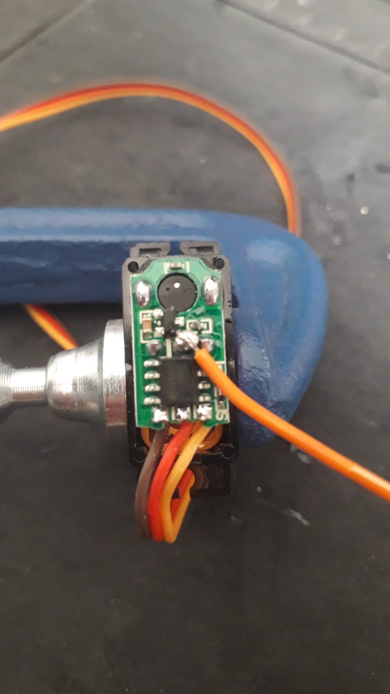 </div>

Now that circuit part is done, the new added wire has to go out of servo's case. So that the case cover (shown below) which has been removed previously has to be modified for letting this new wire going out.
<div>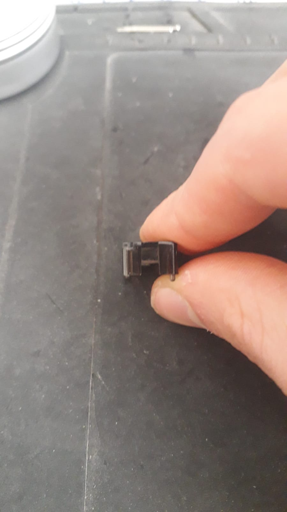 </div>

The modification consists simply in widening wire's hole (left). In my case, I've simply used an old metal saw to cut a little piece of the case, widening its hole. Since the wire pathway is very tightened once in place (center), I recommend to widen the hole up the level of original case(cf left) and not only for wire shape as done just below (right).

| Correct modified hole |  Wiring once in place  | Incorrect hole modification |
| --- | ---- | ---- |
| <div>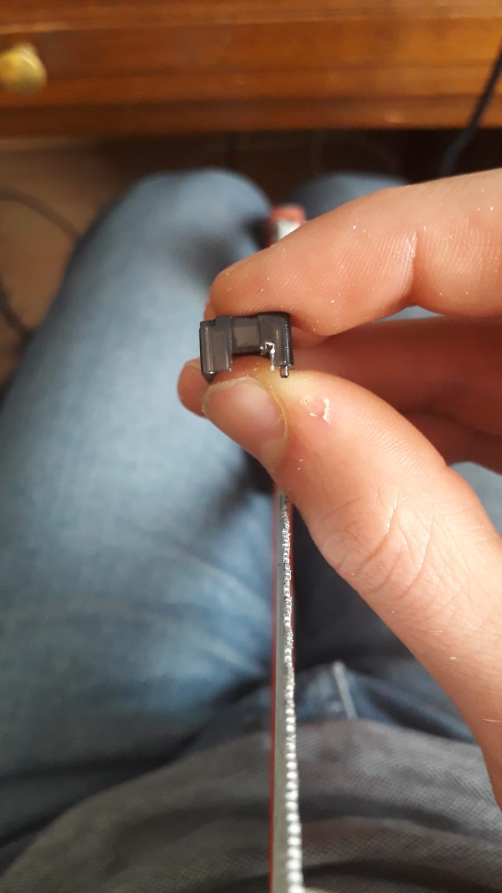 </div> | <div>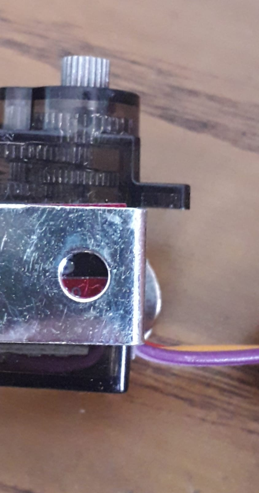 </div> | <div>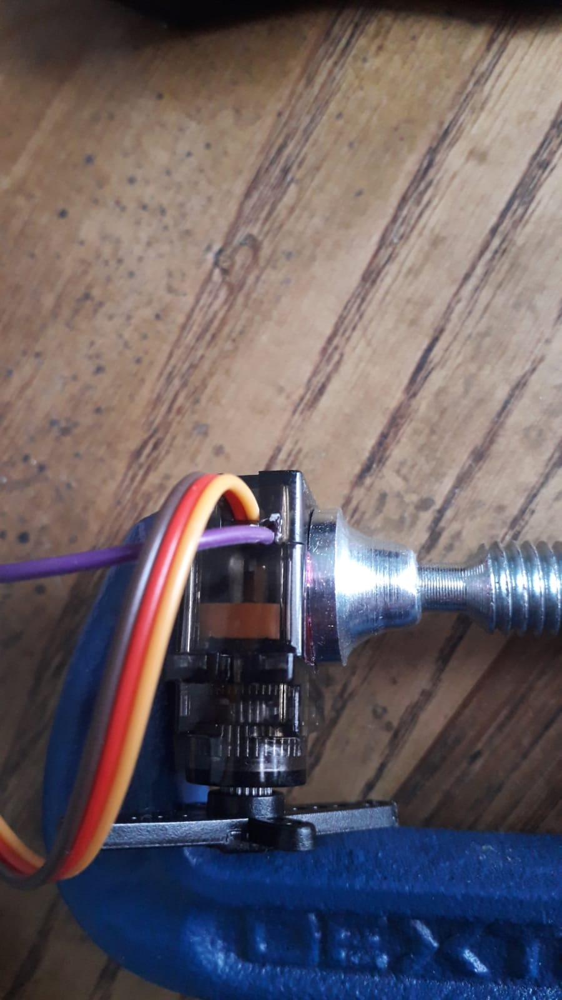 </div> |

Then, finally screw back the cover and motor is ready to be tested with ```./tests_hardware/motor_analogpos_test``` circuit.

<div>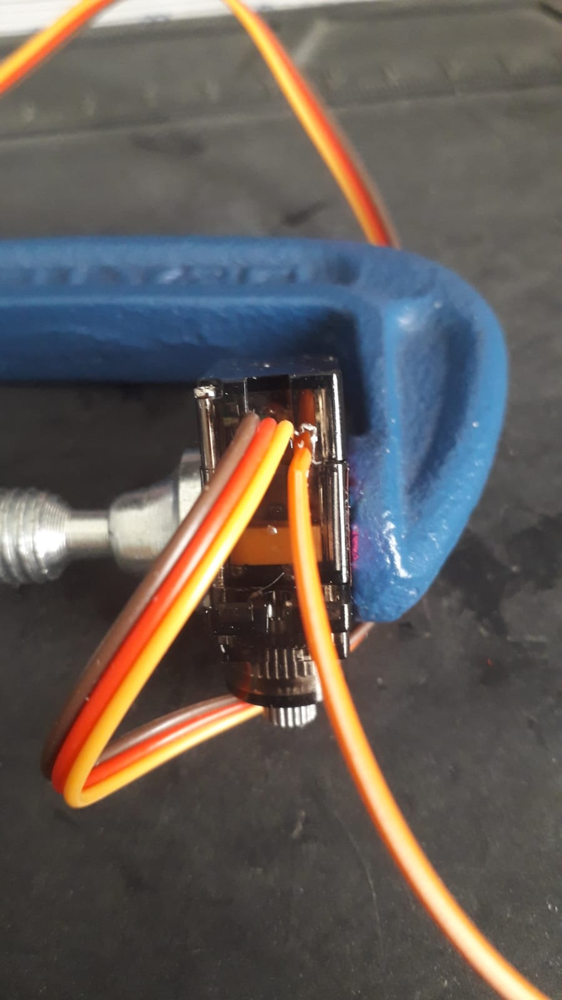 </div>

### PTK 7465

To modify PTK7465, the principle is the same.

- Unscrew cover. Be also cautious not to move reductor.
<div>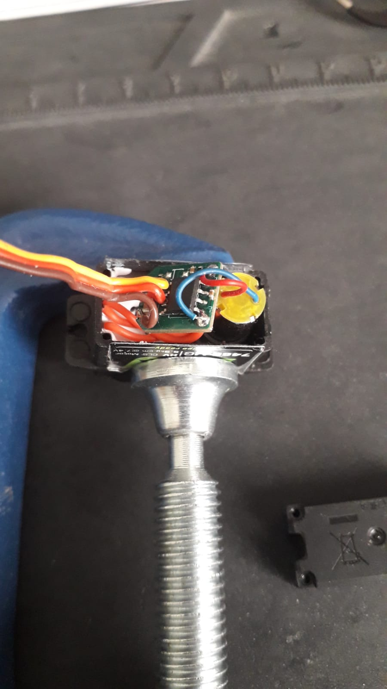 </div>

- Tiny change of layout: rotate the controller for getting access to potentiometer pins (the ones with red wires). Once again, the pin where to sold the additionnal wire is the center pin. 
<div>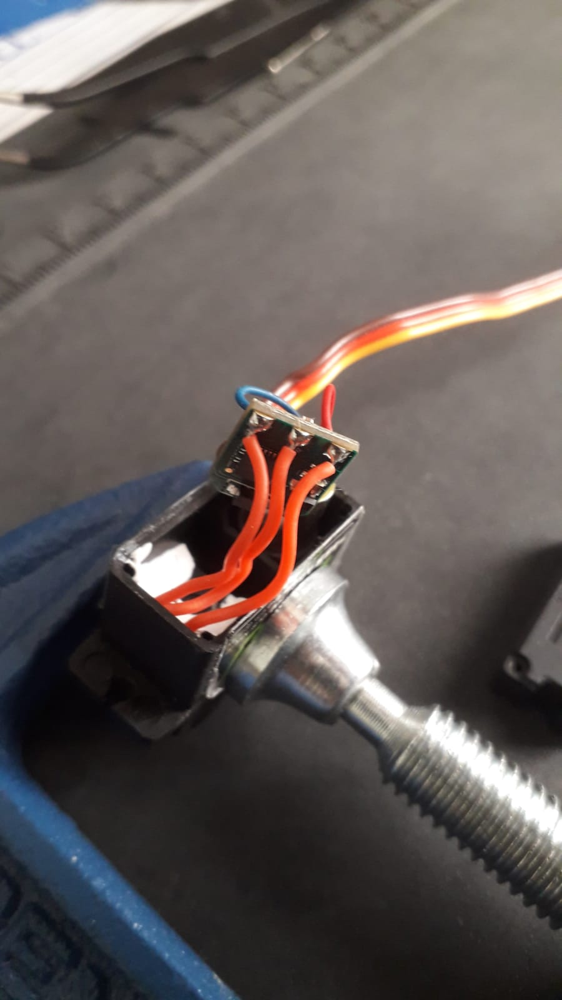 </div>

- Rotate the controller back to its place.
<div>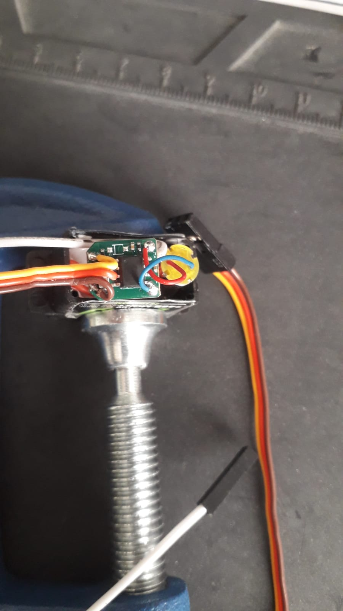 </div>

- Widen cover wire's hole with same constraints and method.
<div>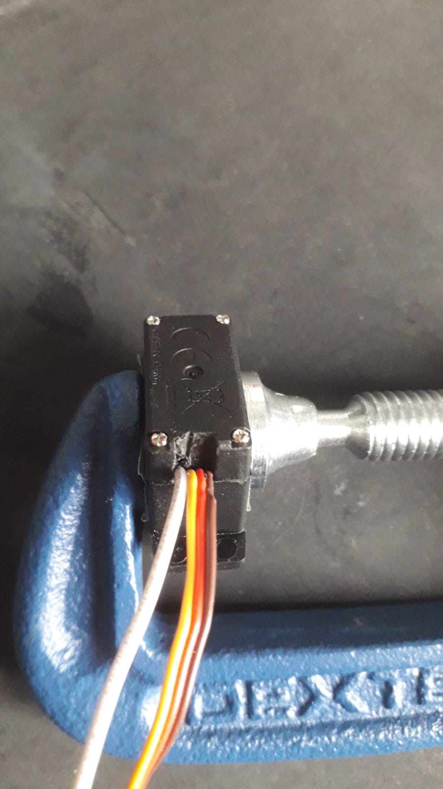 </div>

- Test your modified motor as well with  ```./tests_hardware/motor_analogpos_test``` circuit.